# 🚀 Deploy-Webiste

> Tutorial deploy website di Debian Linux menggunakan Apache2, MariaDB, PHP-FPM, dan Webmin.

---

# 👤 Tahap 1 — SSH ke Server Debian

## Login SSH via CMD Windows

```bash
ssh user@ip_debian
```

## Masuk Root

```bash
su -
```

---

## 📸 Screenshot

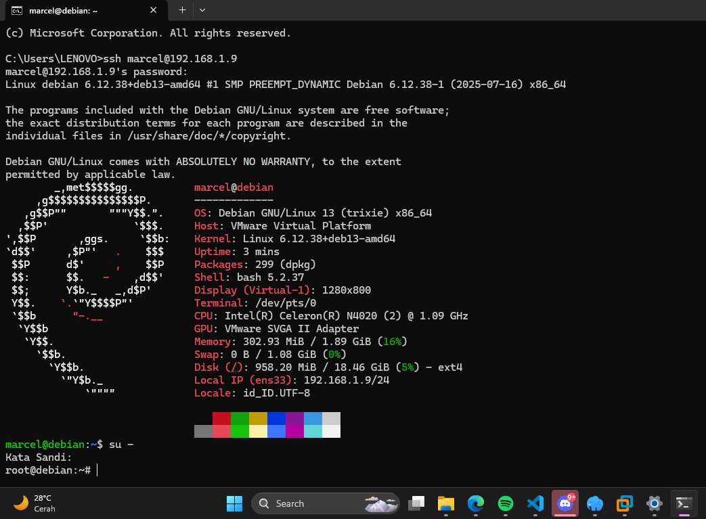

---

# 🌐 Tahap 2 — Setup Apache2 + PHP-FPM

## Install Package

```bash
apt install apache2 mariadb-server php-fpm -y
```

---

## Aktifkan Proxy Module

```bash
a2enmod proxy_fcgi
```

---

## Aktifkan PHP-FPM

```bash
a2enconf php8.4-fpm
```

---

## Reload Apache

```bash
systemctl reload apache2
```

---

## 📸 Screenshot

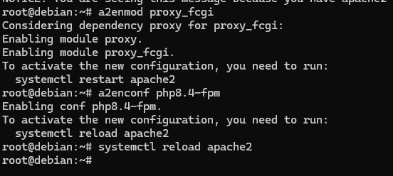

---

# 🔒 Tahap 3 — Setup SSL HTTPS Apache

## Aktifkan SSL Module

```bash
a2enmod ssl
```

---

## Buat Folder SSL

```bash
mkdir ssl
cd ssl
```

---

## Generate SSL Certificate

```bash
openssl req -x509 -nodes -days 90 -newkey rsa:2048 \
-keyout self.key \
-out self.crt
```

---

## Cek File SSL

```bash
ls
```

Pastikan muncul:

```txt
self.key
self.crt
```

---

## Edit SSL Config Apache

```bash
nano /etc/apache2/sites-available/default-ssl.conf
```

---

## Ubah Lokasi SSL

Cari:

```apache
SSLCertificateFile
SSLCertificateKeyFile
```

Contoh:

```apache
SSLCertificateFile /root/ssl/self.crt
SSLCertificateKeyFile /root/ssl/self.key
```

---

## Aktifkan SSL Site

```bash
a2ensite default-ssl.conf
```

---

## Reload Apache

```bash
systemctl reload apache2
```

Jika error:

```bash
systemctl start apache2
```

---

## 📸 Screenshot

### Setup SSL

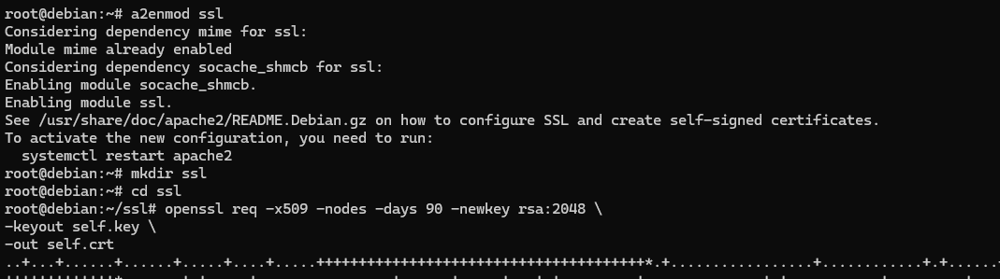

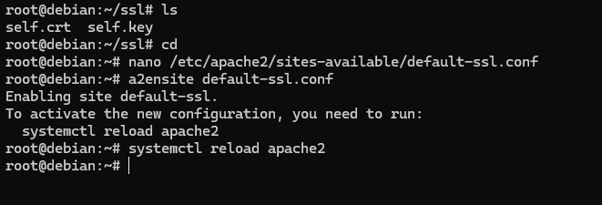

---

### SSL Certificate

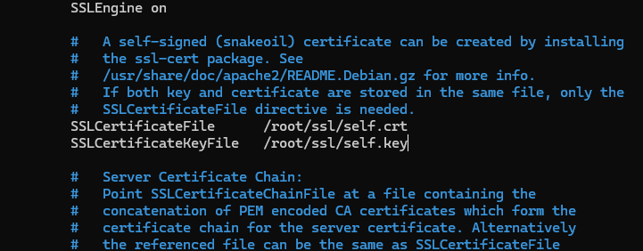

---

# 🖥️ Tahap 4 — Setup Webmin

## Download Webmin

```bash
wget http/ip_website/webmin_2.630_all.deb
```

---

## Install Webmin

```bash
dpkg -i webmin_2.630_all.deb
```

---

## Jika Dependency Error

```bash
apt install -f
```
Lalu dpkg ulang

---

## Akses Webmin

```txt
https://IP_DEBIAN:10000
```

Contoh:

```txt
https://192.168.1.9:10000
```

---

## 📸 Screenshot

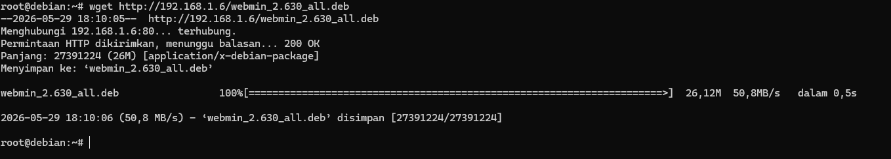

---

# 📂 Tahap 5 — Upload Folder Website

Upload folder website ke:

```txt
/var/www/html
```

---

## Langkah

* Masuk Webmin
* Tools
* File Manager
* Buka `/var/www/html`
* Upload folder website

---

## 📸 Screenshot

### File Manager

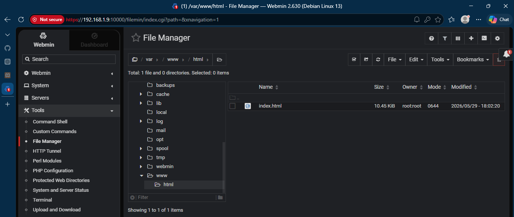

---

### Select Folder

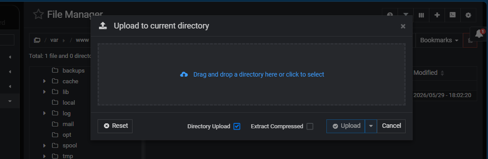

---

### Hasil Upload

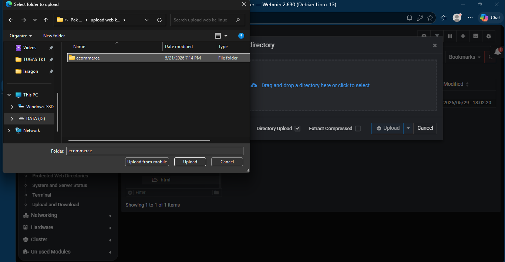

---

# 🔑 Tahap 6 — Buat Password Root MariaDB

## Langkah

* Masuk Webmin
* MariaDB Database Server
* Change Administration Password

---

## 📸 Screenshot

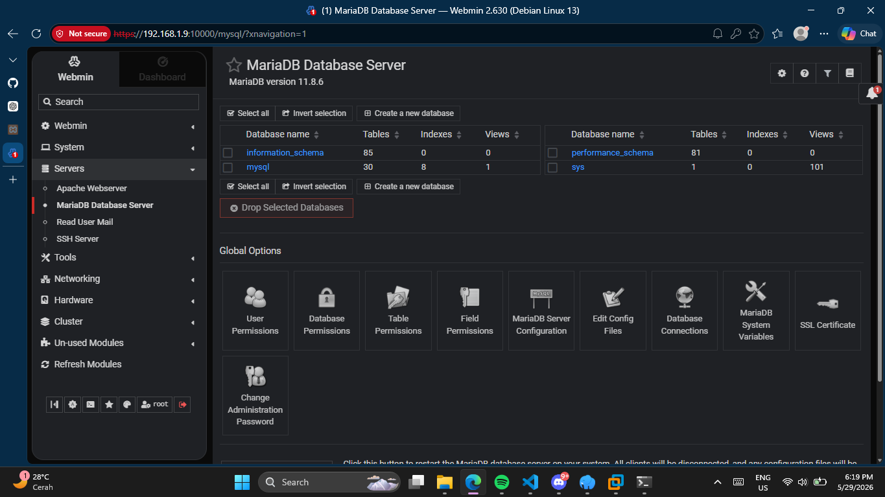

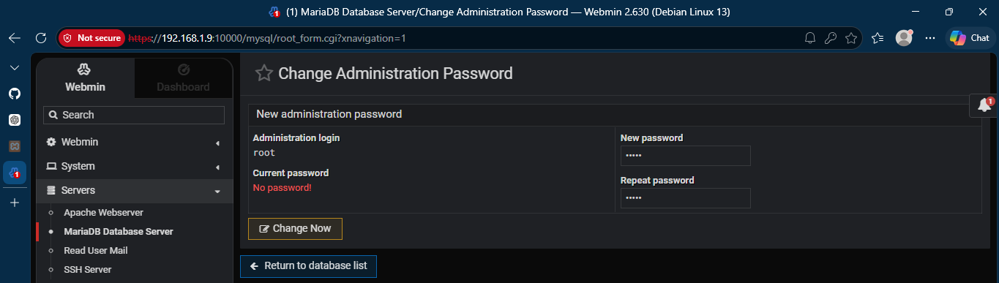

---

# 🗄️ Tahap 7 — Buat Database

## Langkah

* Masuk MariaDB Database Server
* Klik Create a new database
* Isi nama database
* Klik Create

---

## 📸 Screenshot

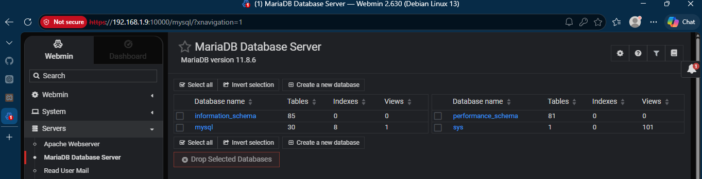

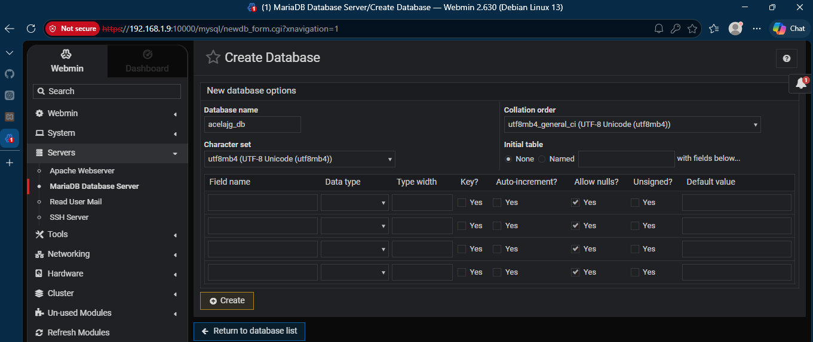

---

# 📥 Tahap 8 — Import SQL via Webmin

## Langkah

* Masuk database
* Execute SQL
* Import text file
* Upload file `.sql`
* Execute

---

## 📸 Screenshot

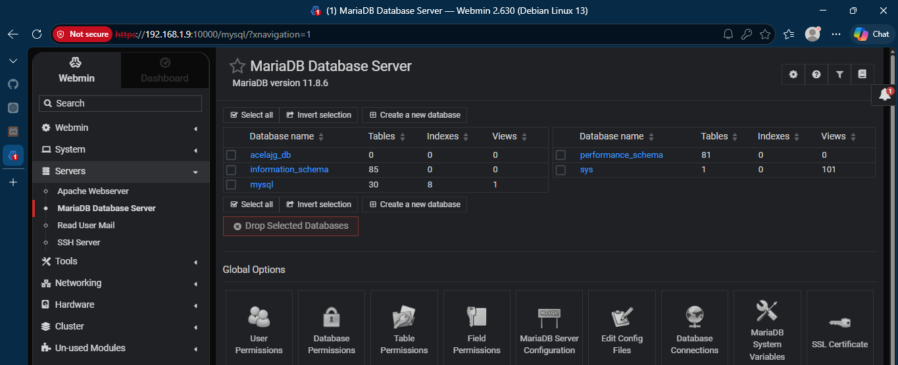

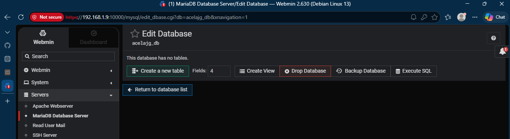

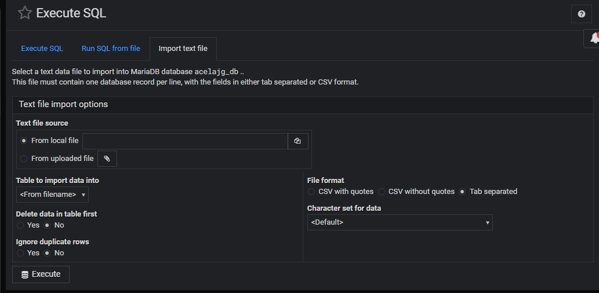

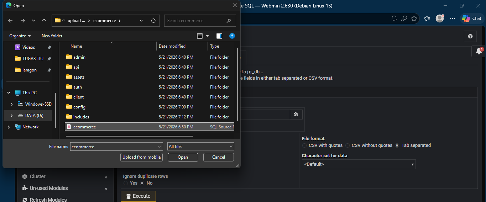

Kalo import bisa, langsung akses website nya
---

# ❌ Jika Error Import SQL

Kadang Webmin error seperti:

```sql
Error 1146 Table doesn't exist
```

---

## 📸 Screenshot Error

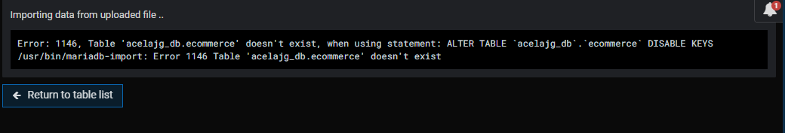

---

# ✅ Hasil Deploy Website

Website berhasil dijalankan.

## 📸 Screenshot

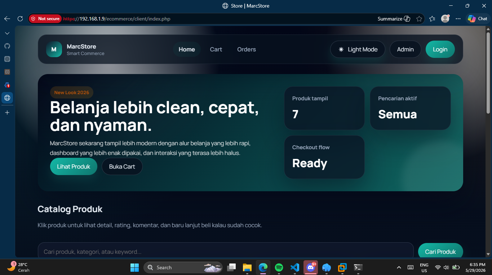

---

# 💻 Trobleshoot — Import SQL via CLI Terminal

Jika Webmin gagal import SQL, gunakan terminal Debian.

---

## Command

```bash
mysql -u root -p nama_database < file.sql
```

---

## Contoh

```bash
mysql -u root -p acelajg_db < /var/www/html/ecommerce/ecommerce.sql
```

---

## 📸 Screenshot

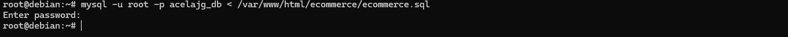
lalu access website kalian
---

# ✅ Hasil Deploy Website

Website berhasil dijalankan.

## 📸 Screenshot


---

## Trobleshoot - error http 500

Jika import sql nya bisa tapi saat akses website nya error HTTP 500

---
1. Ubah configurasi mysql_connect di website kalian serperti user, pass, database. sesuaikan dengan tahap 6 dan 7

## 📸 Screenshot

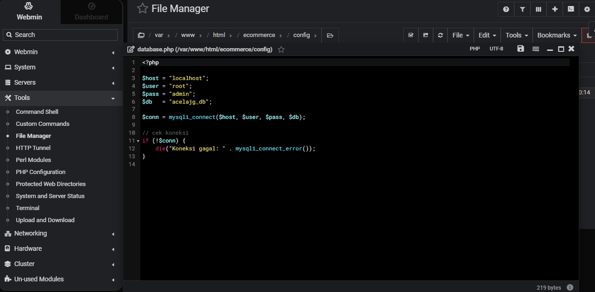
lalu access website kalian
---

# ✅ Hasil Deploy Website

Website berhasil dijalankan.

## 📸 Screenshot


---

# 📁 Struktur Folder Image

```txt
img/
├── create-database.png
├── create-database2.png
├── hasil.png
├── import-sql.png
├── import-sql2.png
├── import-sql3.png
├── import-sql4.png
├── import-sql5.png
├── import-sql6.png
├── rename-ssl.png
├── setup-apcahe2.png
├── setup-pwphp.png
├── setup-pwphp2.png
├── setup-ssl.png
├── setup-ssl1.png
├── ssh.png
├── upload-webiste2.png
├── upload-website.png
├── upload-website3.png
└── wget.png
```

---

# 👨‍💻 Author

Marcelino Kresna Pratama
